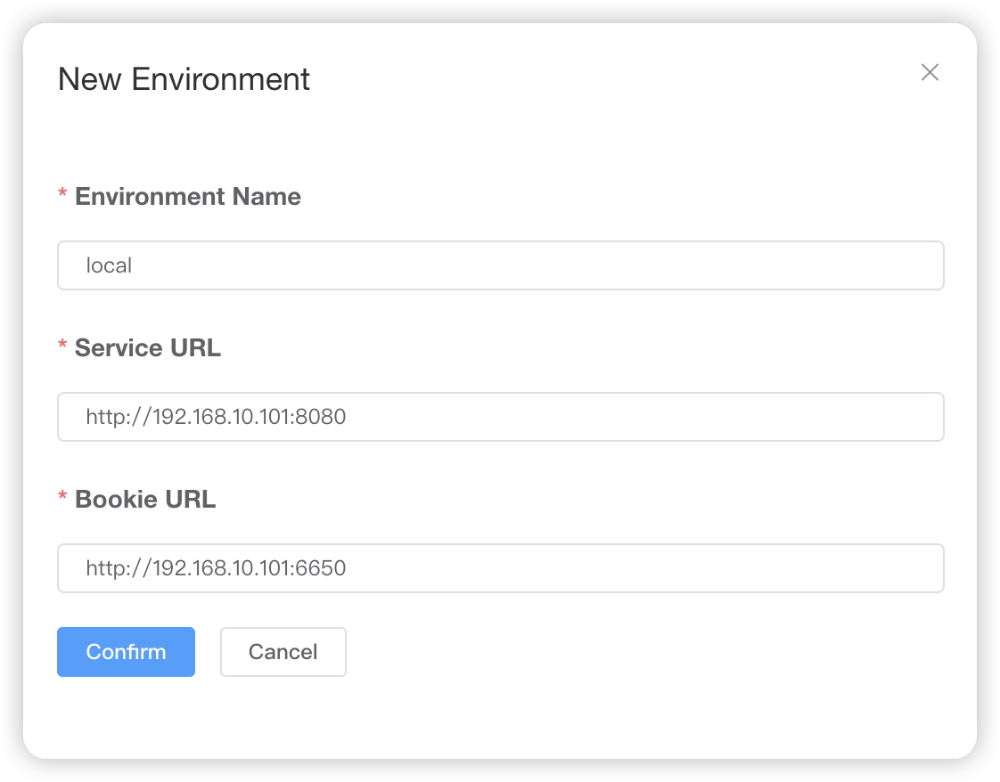

# Docker Compose 部署

## 环境准备

安装 Docker 和 Docker Compose

## 准备 docker-compose.yml 文件

```yaml title="docker-compose.yml"
version: '3'
networks:
  pulsar:
    driver: bridge
services:
  # Start zookeeper
  zookeeper:
    image: apachepulsar/pulsar:3.1.1
    container_name: zookeeper
    restart: on-failure
    networks:
      - pulsar
    volumes:
      - ./data/zookeeper:/pulsar/data/zookeeper
    environment:
      - metadataStoreUrl=zk:zookeeper:2181
      - PULSAR_MEM=-Xms256m -Xmx256m -XX:MaxDirectMemorySize=256m
    command: >
      bash -c "bin/apply-config-from-env.py conf/zookeeper.conf && \
             bin/generate-zookeeper-config.sh conf/zookeeper.conf && \
             exec bin/pulsar zookeeper"
    healthcheck:
      test: ["CMD", "bin/pulsar-zookeeper-ruok.sh"]
      interval: 10s
      timeout: 5s
      retries: 30

  # Init cluster metadata
  pulsar-init:
    container_name: pulsar-init
    hostname: pulsar-init
    image: apachepulsar/pulsar:3.1.1
    networks:
      - pulsar
    command: >
      bin/pulsar initialize-cluster-metadata \
               --cluster cluster-a \
               --zookeeper zookeeper:2181 \
               --configuration-store zookeeper:2181 \
               --web-service-url http://broker:8080 \
               --broker-service-url pulsar://broker:6650
    depends_on:
      zookeeper:
        condition: service_healthy

  # Start bookie
  bookie:
    image: apachepulsar/pulsar:3.1.1
    container_name: bookie
    restart: on-failure
    networks:
      - pulsar
    environment:
      - clusterName=cluster-a
      - zkServers=zookeeper:2181
      - metadataServiceUri=metadata-store:zk:zookeeper:2181
      # otherwise every time we run docker compose uo or down we fail to start due to Cookie
      # See: https://github.com/apache/bookkeeper/blob/405e72acf42bb1104296447ea8840d805094c787/bookkeeper-server/src/main/java/org/apache/bookkeeper/bookie/Cookie.java#L57-68
      - advertisedAddress=bookie
      - BOOKIE_MEM=-Xms512m -Xmx512m -XX:MaxDirectMemorySize=256m
    depends_on:
      zookeeper:
        condition: service_healthy
      pulsar-init:
        condition: service_completed_successfully
    # Map the local directory to the container to avoid bookie startup failure due to insufficient container disks.
    volumes:
      - ./data/bookkeeper:/pulsar/data/bookkeeper
    command: bash -c "bin/apply-config-from-env.py conf/bookkeeper.conf && exec bin/pulsar bookie"

  # Start broker
  broker:
    image: apachepulsar/pulsar:3.1.1
    container_name: broker
    hostname: broker
    restart: on-failure
    networks:
      - pulsar
    environment:
      - metadataStoreUrl=zk:zookeeper:2181
      - zookeeperServers=zookeeper:2181
      - clusterName=cluster-a
      - managedLedgerDefaultEnsembleSize=1
      - managedLedgerDefaultWriteQuorum=1
      - managedLedgerDefaultAckQuorum=1
      - advertisedAddress=broker
      # 如果不是在本地开发，则此处的 IP 改为 broker 服务器所在的 IP
      - advertisedListeners=external:pulsar://127.0.0.1:6650
      - PULSAR_MEM=-Xms512m -Xmx512m -XX:MaxDirectMemorySize=256m
    depends_on:
      zookeeper:
        condition: service_healthy
      bookie:
        condition: service_started
    ports:
      - "6650:6650"
      - "8080:8080"
    command: bash -c "bin/apply-config-from-env.py conf/broker.conf && exec bin/pulsar broker"
  pulsar-manager:
    image: apachepulsar/pulsar-manager:v0.4.0
    container_name: pulsar-manager
    ports:
      - "9527:9527"
      - "7750:7750"
    volumes:
      - ./manager:/manager
    depends_on:
      broker:
        condition: service_started
    networks:
      - pulsar
    environment:
      SPRING_CONFIGURATION_FILE: /pulsar-manager/pulsar-manager/application.properties
```

## 部署 Pulsar

```shell
docker compose up -d
```

## Pulsar Manager

1. 创建管理员账号

    ```shell
    CSRF_TOKEN=$(curl http://localhost:7750/pulsar-manager/csrf-token)
    ```

    ```shell
    curl \
      -H 'X-XSRF-TOKEN: $CSRF_TOKEN' \
      -H 'Cookie: XSRF-TOKEN=$CSRF_TOKEN;' \
      -H "Content-Type: application/json" \
      -X PUT http://localhost:7750/pulsar-manager/users/superuser \
      -d '{"name": "admin", "password": "pulsar", "description": "administrator account.", "email": "lin-mt@outlook.com"}'
    ```

2. 使用管理员账号登陆 [Pulsar Manager](http://127.0.0.1:9527)

3. 创建 Environment

    

## 卸载 Pulsar

```shell
docker compose down
```

## 问题

### 创建 tenant 时，Allowed Cluster 没有选项

下载 pulsar 命令行工具

:::warning
版本需要与 pulsar 版本保持一致
:::

```shell
wget https://archive.apache.org/dist/pulsar/pulsar-3.1.1/apache-pulsar-3.1.1-bin.tar.gz
```
解压文件
```shell
tar xvfz apache-pulsar-3.1.1-bin.tar.gz && cd apache-pulsar-3.1.1
```
更新集群信息
```shell
./bin/pulsar-admin clusters update cluster-a --url http://192.168.10.101:8080
```

### zookeeper 启动失败

将服务器本地挂载路径的文件夹权限改为`777`

```bash
chmod 777 ./data/zookeeper
```

```bash
chmod 777 ./data/bookkeeper
```

## 参考内容

[Run a Pulsar cluster locally with Docker Compose](https://pulsar.apache.org/docs/3.1.x/getting-started-docker-compose/)

[Pulsar command-line tools](https://pulsar.apache.org/docs/3.1.x/reference-cli-tools/)

[Pulsar Manager](https://pulsar.apache.org/docs/3.1.x/administration-pulsar-manager/)

[Manager doesn't show the Standalone cluster option for adding to tenant](https://github.com/apache/pulsar-manager/issues/292)

