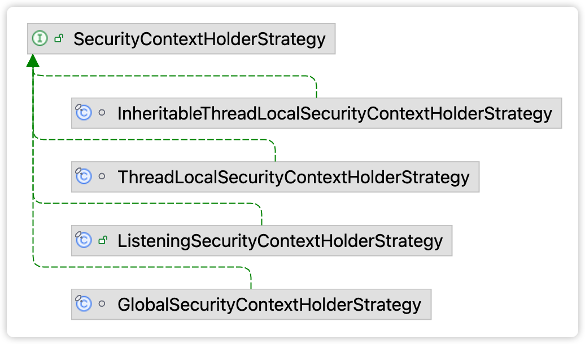
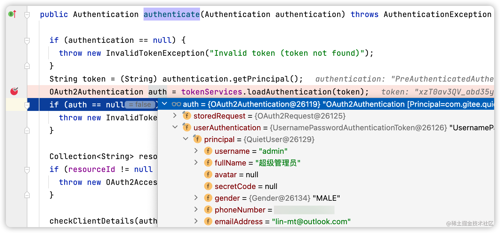
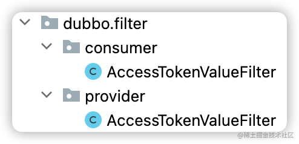

# 服务提供者如何获取当前用户

## 问题

项目中使用了 Dubbo 实现服务间调用，使用 Spring Security Oauth2 实现授权和鉴权。在服务消费者调用服务提供者的时候，服务提供者无法通过`SecurityContextHolder.getContext().getAuthentication()`获取当前用户信息。

## 问题分析

为什么在使用 Dubbo 调用时，服务提供者无法使用`SecurityContextHolder.getContext().getAuthentication()`获取当前用户信息，要搞清楚这个问题，先分析获取当前用户信息的过程。

### 获取用户信息的过程

方法`SecurityContextHolder.getContext().getAuthentication()`是通过调用`SecurityContextHolder`里面的`strategy`属性的`getContext`方法获取`SecurityContext`实例，然后再通过`SecurityContext`的`getAuthentication`获取用户信息的。

`SecurityContextHolderStrategy`是一个接口类，它的实现类如下：



它一共有四种实现类，那么在应用中，它使用的是哪一种实现类，先看下`SecurityContextHolder`。

`SecurityContextHolder`是将给定的`SecurityContext`与当前执行线程关联起来，获取和设置`SecurityContext`的方式是委托给`strategy`属性：

```java
/**
 * 1. 首先会获取 JVM 的 spring.security.strategy 属性
 * 2. 在类加载的时候会调用一次 initialize 方法，进行初始化
 * 3. 根据 spring.security.strategy 属性，采用不同的实现类初始化 strategy 属性
 * 4. 如果没有设置 spring.security.strategy 属性，则默认使用 MODE_THREADLOCAL 策略
 * 5. MODE_THREADLOCAL 策略，strategy 则是使用 ThreadLocalSecurityContextHolderStrategy 进行初始化
 **/
public static final String SYSTEM_PROPERTY = "spring.security.strategy";

private static String strategyName = System.getProperty(SYSTEM_PROPERTY);

static {
 initialize();
}

private static void initialize() {
 initializeStrategy();
 // 初始化次数 +1
 initializeCount++;
}

private static void initializeStrategy() {
 if (MODE_PRE_INITIALIZED.equals(strategyName)) {
  Assert.state(strategy != null, "When using " + MODE_PRE_INITIALIZED
    + ", setContextHolderStrategy must be called with the fully constructed strategy");
  return;
 }
 if (!StringUtils.hasText(strategyName)) {
  // Set default
  strategyName = MODE_THREADLOCAL;
 }
 if (strategyName.equals(MODE_THREADLOCAL)) {
  strategy = new ThreadLocalSecurityContextHolderStrategy();
  return;
 }
 if (strategyName.equals(MODE_INHERITABLETHREADLOCAL)) {
  strategy = new InheritableThreadLocalSecurityContextHolderStrategy();
  return;
 }
 if (strategyName.equals(MODE_GLOBAL)) {
  strategy = new GlobalSecurityContextHolderStrategy();
  return;
 }
 // Try to load a custom strategy
 try {
  // 我们也可以自定义实现策略，扩展性+++
  Class<?> clazz = Class.forName(strategyName);
  Constructor<?> customStrategy = clazz.getConstructor();
  strategy = (SecurityContextHolderStrategy) customStrategy.newInstance();
 }
 catch (Exception ex) {
  ReflectionUtils.handleReflectionException(ex);
 }
}
```

看下`ThreadLocalSecurityContextHolderStrategy`类，可以发现这个类是通过一个`ThreadLocal`属性存储和获取`SecurityContext`:

```java
private static final ThreadLocal<SecurityContext> contextHolder = new ThreadLocal<>();
```

再看看接口`SecurityContextHolderStrategy`，可以发现它提供了`setContext`方法来设置`SecurityContext`，所以在使用`SecurityContextHolder.getContext().getAuthentication()`获取的`SecurityContext`就是通过`setContext`方法设置的值，如果没有手动指定其他策略的话，也就是`org.springframework.security.core.context.ThreadLocalSecurityContextHolderStrategy#contextHolder`存储的值，看下`SecurityContext`的实现类，可以发现用户信息是通过`org.springframework.security.core.context.SecurityContextImpl#getAuthentication`方法获取的，而获取的用户信息是`SecurityContext`使用方法`setAuthentication`设置的，设置的用户信息又是从哪来的呢？

### `SecurityContext`的`authentication`是从哪来的

在上面的分析中，可知 Spring Security 是如何设置的`authentication`，在此打个断点：


再跟踪下堆栈信息：


在此可以发现用户信息是在方法：`org.springframework.security.oauth2.provider.authentication.OAuth2AuthenticationProcessingFilter#doFilter`中获取和设置的，在这个方法中，关键在于这段代码：

```java
Authentication authResult = authenticationManager.authenticate(authentication);
```

这段代码验证并获取了用户信息，在分析这段代码之前，可以先留意下这个方法中的这段代码：`request.setAttribute(OAuth2AuthenticationDetails.ACCESS_TOKEN_VALUE, authentication.getPrincipal());`。

在`authenticationManager.authenticate`打个断点，跟踪下去，可以发现在方法`org.springframework.security.oauth2.provider.authentication.OAuth2AuthenticationManager#authenticate`中获取了用户信息：



到此可知获取用户信息的流程，从`authentication.getPrincipal()`获取 token，再通过 token 到`tokenServices`获取用户信息，`tokenServices`是通过一个`tokenStore`和 token 获取用户信息，这个`tokenStore`是在整合 Spring Security Oauth2 时注入的一个 Bean，这个 Bean 可以用来存储和获取用户信息，具体的实现方式可以实现接口`org.springframework.security.oauth2.provider.token.TokenStore`进行扩展，当然`tokenServices`也可以自己实现。

还记得上面留意的那段代码吗？Spring Security Oauth2 其实已经把这个 token 设置到 request 的属性中了。

现在搞明白了方法`SecurityContextHolder.getContext().getAuthentication()`获取用户信息的整个过程，并且在 Dubbo 调用的时候，接下来分析通过该方法获取用户信息的原因。

## 解决方案

既然用的是 Dubbo 发起的请求，那么是否可以在发起请求和受理请求的时候，对请求进行处理，像这种开源项目，其提供的扩展点是很多的，在 Dubbo 中我们可以通过 [自定义 Filter](https://dubbo.apache.org/zh/docs3-v2/java-sdk/concepts-and-architecture/service-invocation/#filter%E6%8B%A6%E6%88%AA%E5%99%A8) 在服务消费者和服务提供者之间实现数据的添加和获取，其原理类似 Java SPI。

### 方案一：传递用户信息

既然服务提供者无法获取当前用户信息，那我们可以在调用的时候把整个用户信息都传递过去，然后再设置到`SecurityContext`中，这样服务提供者就能获取当前用户信息了。这个方案是可以解决问题的，但是非常不好，因为每个用户的用户信息数据量是不固定的，每个用户拥有的权限、角色等信息都是不一样的，传递的数据量不可控，而且会消耗大量的网络资源。使用这种方案还需要解决序列化的问题，因为这个方案不是最佳的，这里就不展开了。

### 方案二：自己定义一个 key，将用户信息存到 Redis

在服务消费者发起请求的时候，自己定义一个 Redis key，将用户信息存储到 Redis，然后再将这个 key 传递给服务提供者，服务提供者再去 Redis 获取用户信息。

首先呢，Redis 已经存有一份用户信息了，再存一份，属实没必要，而且还需要维护两份用户信息，保持两份用户信息的一致。再者，这个 Redis key 的过期时间要怎么设置？设置一个固定的时间？这个是不行的，因为在整个系统中，用户有一个统一的 token 过期时间，如果自定义的 Redis key 时间是固定的，就会出现 token 已经过期，但是服务提供者无法知晓当前用户已经过期，因为在 Redis key 还未过期的时候它仍然能获取用户信息，这已经破坏了系统的整体性，那么就得动态去计算这个 Redis key 的过期时间。

### 方案三：直接使用 token

直接使用 token，服务消费者和服务提供者以及整个系统都共用一个用户信息，方案一和方案二的所有问题也就不存在了。已经知晓如何通过一个 token 获取当前用户信息，那么可以从 request 中获取并直接传递 token，在服务提供者处**复现获取用户信息的过程**。同时，服务提供者**什么时候获取用户信息**也是需要考虑的，因为服务消费者调用服务提供者的接口时，服务提供者并不一定需要当前用户信息，如果在请求到达服务提供者的 Filter 时就马上去获取用户信息，设置到`SecurityContext`中，获取的用户信息对服务提供者的接口来说并不一定是有用的（可能大部分接口的业务逻辑是不需要用户信息的），那么这就会造成大量的资源浪费。

也就是说，除了解决如何使用 Filter 传递 token 之外，我们还需要解决两个问题：

1. 如何通过 token 重新获取当前用户信息
2. 如何实现服务提供者在需要的时候才真正去获取用户信息

## 实现步骤

### 传递 token

在 Dubbo 中如何自定义 Filter：[调用拦截扩展](https://dubbo.apache.org/zh/docs3-v2/java-sdk/reference-manual/spi/description/filter/)

#### 创建配置文件

在文件夹`src/main/java/resources/META-INF/dubbo`下创建文件名为`org.apache.dubbo.rpc.Filter`的纯文本文件，文件内容为：

```text
token-value-consumer=com.github.quiet.service.dubbo.filter.consumer.AccessTokenValueFilter
token-value-provider=com.github.quiet.service.dubbo.filter.provider.AccessTokenValueFilter
```

#### 注册这两个 Filter

```yml
dubbo:
  consumer:
    filter: token-value-consumer
  provider:
    filter: token-value-provider
```

#### 定义服务消费者和服务提供者的 Filter



#### 在服务消费者发起调用的时候获取 requset 中的 token 值

```java
RequestAttributes requestAttributes = RequestContextHolder.getRequestAttributes();
String tokenValue = (String)((ServletRequestAttributes) requestAttributes)
            .getRequest()
            // 这个 key 在上篇有提到
            .getAttribute(OAuth2AuthenticationDetails.ACCESS_TOKEN_VALUE);
```

这个地方会有个问题，如果是服务`A`调用服务`B`，服务`B`调用服务`C`，这时候服务`B`是服务消费者，获取的`requestAttributes`是`null`，这时就无法获取 token 了。

分析并解决：服务`B`其实是有 token 的，只是在调用服务`C`的时候无法在 Filter 处获取而已，此时我们可以借助 ThreadLocal：

```java
public static final ThreadLocal<String> USER_TOKEN = ThreadLocal.withInitial(() -> "");
```

### 通过 token 获取用户信息

可以使用 token 在`tokenStore`中获取用户信息，`tokenStore`是注入的一个 Bean，那么就可以从 Spring 容器中获取这个 Bean：

```java
TokenStore tokenStore = SpringUtil.getBean(TokenStore.class);
OAuth2Authentication authentication = tokenStore.readAuthentication(tokenValue);
```

### 服务提供者如何在需要用户信息的时候才去获取

为了不影响 web 请求获取用户信息的方式，在使用 Dubbo 调用的时候，服务提供者尽可能考虑通过与 web 请求获取用户信息相同的方式获取当前用户信息，也就是通过`SecurityContextHolder.getContext().getAuthentication()`方法获取用户信息，如果实在无法实现，再考虑自定义一种能满足这两种情况下都能获取用户信息的方式。

分析了`SecurityContextHolder`，在这个类里面提供了`setContext`方法设置`SecurityContext`，再分析`org.springframework.security.core.context.SecurityContext`，这是一个接口，可以自己定义实现类，在自定义的实现类中，在调用`getAuthentication`的时候才去获取用户信息，再将这个自定义类的实例作为形参调用`setContext`，就可以实现服务提供者在需要用户信息的时候才去获取用户信息：

```java
public class QuietSecurityContext implements SecurityContext {

  private final String tokenValue;

  private final SecurityContext securityContext = SecurityContextHolder.getContext();

  public QuietSecurityContext(@NotBlank String tokenValue) {
    this.tokenValue = tokenValue;
  }

  @Override
  public Authentication getAuthentication() {
    if (securityContext.getAuthentication() != null) {
      return securityContext.getAuthentication();
    }
    TokenStore tokenStore = SpringUtil.getBean(TokenStore.class);
    OAuth2Authentication authentication = tokenStore.readAuthentication(tokenValue);
    this.setAuthentication(authentication);
    return securityContext.getAuthentication();
  }

  @Override
  public void setAuthentication(Authentication authentication) {
    securityContext.setAuthentication(authentication);
  }
}
```

这里用到了设计模式中的装饰器模式。

# Filter 实现

`com.github.quiet.service.dubbo.filter.consumer.AccessTokenValueFilter`

```java
@Activate(group = CommonConstants.CONSUMER)
public class AccessTokenValueFilter implements Filter {

  @Override
  public Result invoke(Invoker<?> invoker, Invocation invocation) throws RpcException {
    RequestAttributes requestAttributes = RequestContextHolder.getRequestAttributes();
    String tokenValue;
    if (requestAttributes != null) {
      tokenValue =
          (String)
              ((ServletRequestAttributes) requestAttributes)
                  .getRequest()
                  .getAttribute(OAuth2AuthenticationDetails.ACCESS_TOKEN_VALUE);
    } else {
      tokenValue = DubboThreadLocal.USER_TOKEN.get();
    }
    if (StringUtils.isNotBlank(tokenValue)) {
      invocation.setAttachment(OAuth2AuthenticationDetails.ACCESS_TOKEN_VALUE, tokenValue);
    }
    return invoker.invoke(invocation);
  }
}
```

`com.github.quiet.service.dubbo.filter.provider.AccessTokenValueFilter`

```java
@Activate(group = CommonConstants.PROVIDER)
public class AccessTokenValueFilter implements Filter {

  @Override
  public Result invoke(Invoker<?> invoker, Invocation invocation) throws RpcException {
    String tokenValue = invocation.getAttachment(OAuth2AuthenticationDetails.ACCESS_TOKEN_VALUE);
    if (StringUtils.isNotBlank(tokenValue)) {
      DubboThreadLocal.USER_TOKEN.set(tokenValue);
      SecurityContextHolder.setContext(new QuietSecurityContext(tokenValue));
    }
    try {
      return invoker.invoke(invocation);
    } finally {
      if (StringUtils.isNotBlank(tokenValue)) {
        SecurityContextHolder.clearContext();
        DubboThreadLocal.USER_TOKEN.remove();
      }
    }
  }
}
```
