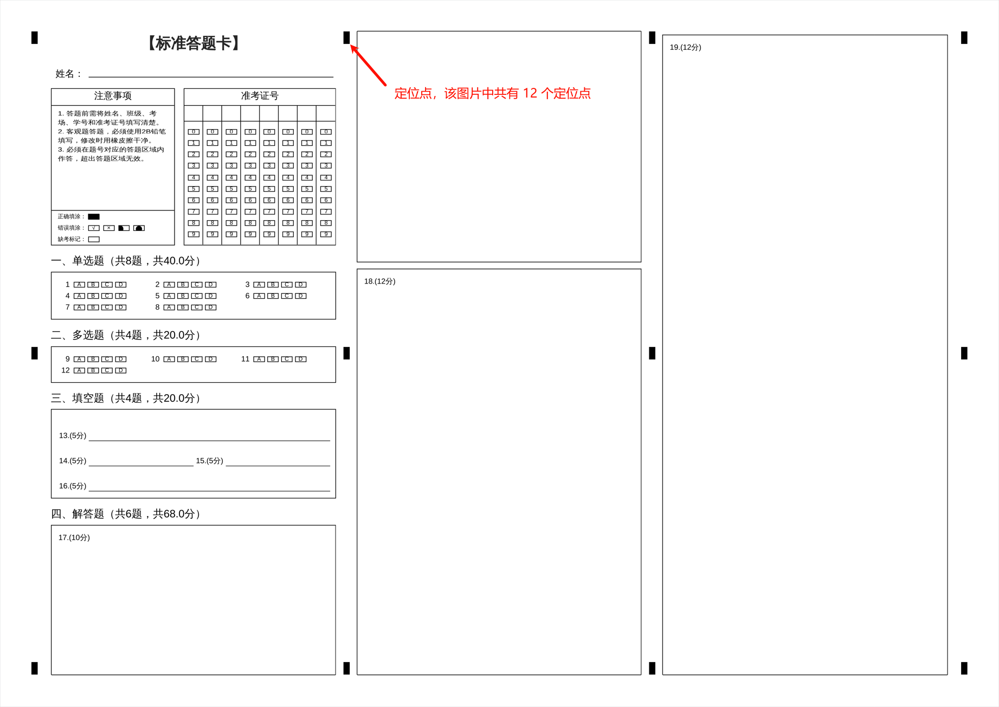
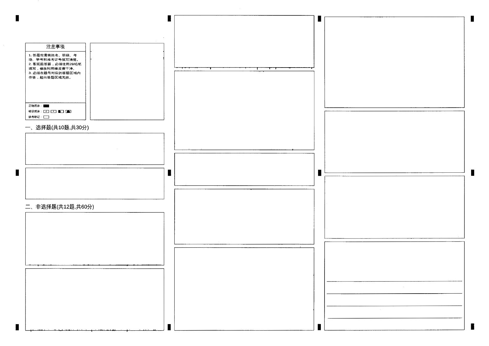

# 使用 OpenCV 矫正图片

在矫正图片之前需要先[加载 OpenCV 库](using-opencv-in-spring-boot.md)

原图示例：



矫正图示例（定位点布局位置相同即可）：



## 流程概要

1. 明确定位点的样式，比如定位点的长、宽、像素信息等。
2. 如果有原图则从原图读取定位点位置。
3. 从需要矫正的图片中读取定位点的位置。
4. 因为矫正图片的其他位置可能出现类似的定位点信息，所以需要过滤读取出来的定位点信息。
5. （可选）如果读取出来的定位点数量不足，将需要矫正的图片进行去噪处理，使用去噪后的图片从第三步开始。
6. 如果需要矫正的图片出现定位点缺失，使用不同的矫正算法进行矫正。

从需要矫正的图片中读取出来的定位点越多，矫正后的图片越接近原图。

:::tip
使用中值滤波去噪时选择 ksize 的技巧
- 较小的 ksize（如 3 或 5）适合处理细微噪声，保持图像细节。
- 较大的 ksize 会更强烈地平滑图像，但可能会导致细节丢失。
- 一般来说，ksize 的选择取决于图像的噪声类型和处理需求。
:::

## 关键代码方法实现

### 获取定位点信息

:::tip
需要矫正的图片的长宽要和获取定位点的原图片的长宽一致，这样定位点的信息才是准确的。
:::

```java title="Scan.java"
@Data
public class Scan {

  private int width;
  private int height;
  private int originalWidth;
  private int originalHeight;
  private int blackPixels;
  private List<Point> points;

  public List<Point> getPoints() {
    return new ArrayList<>(points);
  }
}
```

```java title="Location.java"
@Data
public class Location {
  private Scan scan;
  private Mat srcMat;
  private Mat grayMat;
}
```

```java title="OpenCvUtils.java"

  private static final int MINIMUM_SIMILARITY_COORDINATE_DIFFERENCE = 300;
  private static final List<Integer> K_SIZES = List.of(3, 5, 7, 9, 11, 13, 15);

  /**
   * 获取定位点
   *
   * @param sourceImage 图片文件
   * @param width 读取定位点原图的宽度
   * @param height 读取定位点原图的高度
   * @param points 矫正的定位点信息（矫正时过滤定位点需要）
   * @param pointCount 定位点个数
   * @return 定位点信息
   */
  @SneakyThrows
  public static Location getForLocation(
      File sourceImage, int width, int height, List<Point> points, Integer pointCount) {
    if (!FileUtils.isImage(sourceImage.getName())) {
      throw new IllegalArgumentException("不是图片无法获取定位信息");
    }
    if (pointCount == null) {
      pointCount = CollUtil.size(points);
    }
    BufferedImage old = ImageIO.read(sourceImage);
    BufferedImage outputImage = new BufferedImage(width, height, BufferedImage.TYPE_INT_RGB);
    // 使用图像处理工具进行尺寸调整
    Graphics2D graphics2D = outputImage.createGraphics();
    graphics2D.setRenderingHint(
        RenderingHints.KEY_INTERPOLATION, RenderingHints.VALUE_INTERPOLATION_BILINEAR);
    graphics2D.drawImage(old, 0, 0, width, height, null);
    graphics2D.dispose();
    String parent = sourceImage.getParent();
    String openCv = SystemUtils.buildPath(parent, "openCv", sourceImage.getName());
    File openCvFile = new File(openCv);
    openCvFile.deleteOnExit();
    FileUtil.touch(openCvFile);
    ImageIO.write(outputImage, Objects.requireNonNull(FileUtils.getType(openCvFile)), openCvFile);
    Mat source = Imgcodecs.imread(openCv, Imgcodecs.IMREAD_COLOR);
    Pair<Mat, List<Point>> grayMatPoints = detectBlackSquares(source, points);
    if (!pointCount.equals(grayMatPoints.getRight().size())) {
      // 从图片中获取的定位点数量不对
      String imageDenoising;
      // 使用不同的滤波器内核大小对图片去噪后重新获取定位点
      for (Integer ksize : K_SIZES) {
        imageDenoising = imageDenoising(new File(openCv), ksize);
        Mat imread = Imgcodecs.imread(imageDenoising, Imgcodecs.IMREAD_COLOR);
        grayMatPoints = detectBlackSquares(imread, points);
        if (pointCount.equals(grayMatPoints.getRight().size())) {
          FileUtil.del(imageDenoising);
          break;
        }
        FileUtil.del(imageDenoising);
      }
    }
    Location location = new Location();
    location.setSrcMat(source);
    location.setGrayMat(grayMatPoints.getLeft());
    Scan scan = new Scan();
    scan.setPoints(grayMatPoints.getRight());
    location.setScan(scan);
    return location;
  }
  
  /**
   * 使用中值滤波进行图片去噪
   *
   * @param file 去噪的图片
   * @param ksize 滤波器内核的大小，必须是 正的奇数（如 3, 5, 7 等）。
   * @return 去噪后的图片位置
   */
  private static String imageDenoising(File file, int ksize) {
    String filePath = file.getAbsolutePath();
    Mat image = Imgcodecs.imread(filePath);
    Mat grayImage = new Mat();
    Imgproc.cvtColor(image, grayImage, Imgproc.COLOR_BGR2GRAY);
    Imgproc.medianBlur(grayImage, grayImage, ksize);
    String denoisingImage = TempDirUtils.denoisingImage(file.getName());
    File denoisingFile = new File(denoisingImage);
    FileUtil.touch(denoisingFile);
    Imgcodecs.imwrite(denoisingImage, grayImage);
    return denoisingFile.getAbsolutePath();
  }
  
  /**
   * 读取出灰度图片和定位点信息
   * 
   * @param src 图片信息
   * @param points 原图定位点信息（过滤读取矫正图片的定位点时使用）
   * @return 灰度图信息和定位点信息
   */
  private static Pair<Mat, List<Point>> detectBlackSquares(Mat src, List<Point> points) {
    List<Point> locations = new ArrayList<>();
    if (src.empty()) {
      log.error("读取的图片为空!");
      return Pair.of(null, locations);
    }
    Mat gray = new Mat();
    Imgproc.cvtColor(src, gray, Imgproc.COLOR_BGR2GRAY);
    Mat binaryImage = new Mat();
    Imgproc.threshold(gray, binaryImage, 200, 255, Imgproc.THRESH_BINARY_INV);
    List<MatOfPoint> contours = new ArrayList<>();
    Mat hierarchy = new Mat();
    Imgproc.findContours(
        binaryImage, contours, hierarchy, Imgproc.RETR_EXTERNAL, Imgproc.CHAIN_APPROX_SIMPLE);
    Map<Point, List<Rect>> pointMap = new HashMap<>();
    for (MatOfPoint contour : contours) {
      Rect rect = Imgproc.boundingRect(contour);
      // 根据定位点的宽高在一定误差范围内判断是否为定位点
      boolean isLocatingPoint =
          rect.width >= 25 && rect.width <= 70 && rect.height >= 50 && rect.height <= 90;
      if (isLocatingPoint) {
        Mat roi = binaryImage.submat(rect);
        double fill = (double) Core.countNonZero(roi) / roi.size().area();
        if (CollUtil.isEmpty(points)) {
          // 如果没有 points 则是读取原图定位点，原图定位点的黑色像素占比是很非常高的
          if (fill < 0.95) {
            continue;
          }
        }
        if (CollUtil.isNotEmpty(points)) {
          // 过滤矫正图片读取出来的定位点
          for (Point point : points) {
            // 矫正图片的定位点中心点与原图的定位点相距 300 像素以内则判定为矫正图片的定位点位置
            if (Math.abs(point.x - (rect.x + rect.width / 2.0))
                    <= MINIMUM_SIMILARITY_COORDINATE_DIFFERENCE
                && Math.abs(point.y - (rect.y + rect.height / 2.0))
                    <= MINIMUM_SIMILARITY_COORDINATE_DIFFERENCE) {
              // 矫正图片的定位点可能因多种原因（打印、摩擦等）导致定位点的黑色像素占比减少
              if (fill < 0.83) {
                continue;
              }
              pointMap.putIfAbsent(point, new ArrayList<>());
              pointMap.get(point).add(rect);
              break;
            }
          }
        } else {
          // 读取的是原图定位点，取定位点中间位置
          locations.add(new Point(rect.x + rect.width / 2.0, rect.y + rect.height / 2.0));
        }
      }
    }
    Map<Point, Point> pointPointMap = new LinkedHashMap<>();
    pointMap.forEach(
        ((point, rects) -> {
          Rect maxRect = rects.get(0);
          // 进一步过滤定位点，从矫正图片的定位点中找出离原图定位点最近的定位点
          if (rects.size() != 1) {
            Mat maxMat = binaryImage.submat(maxRect);
            double max = (double) Core.countNonZero(maxMat) / maxMat.size().area();
            for (int i = 1; i < rects.size(); i++) {
              Rect nextRect = rects.get(i);
              Mat nextMat = binaryImage.submat(nextRect);
              double fill = (double) Core.countNonZero(nextMat) / nextMat.size().area();
              if (fill > max) {
                maxRect = nextRect;
                continue;
              }
              if (fill == max) {
                if (Math.abs(point.x - (maxRect.x + maxRect.width / 2.0))
                    > Math.abs(point.x - (nextRect.x + nextRect.width / 2.0))) {
                  maxRect = nextRect;
                }
              }
            }
          }
          pointPointMap.put(
              point, new Point(maxRect.x + maxRect.width / 2.0, maxRect.y + maxRect.height / 2.0));
        }));
    if (CollUtil.isNotEmpty(points)) {
      for (Point point : points) {
        Point matched = pointPointMap.get(point);
        if (matched != null) {
          locations.add(matched);
        }
      }
    }
    return Pair.of(gray, locations);
  }
```

### 从原图定位点中去掉没有在矫正图片中获取出的对应的定位点

```java title="OpenCvUtils.java"
  /**
   * 过滤原图定位点
   * @param points 原图定位点
   * @param scanPoints 从矫正图片中获取的定位点
   * @return 与矫正图片中获取的定位点一一对应的原图定位点
   */
  public static List<Point> getSimilarPoints(List<Point> points, List<Point> scanPoints) {
    List<Point> newPoint = new ArrayList<>();
    for (Point scanPoint : scanPoints) {
      for (Point point : points) {
        if (OpenCvUtils.isSimilarPoints(scanPoint, point)) {
          newPoint.add(point);
        }
      }
    }
    return newPoint;
  }

  public static boolean isSimilarPoints(Point point, Point other) {
    return Math.abs(point.x - other.x) <= MINIMUM_SIMILARITY_COORDINATE_DIFFERENCE
        && Math.abs(point.y - other.y) <= MINIMUM_SIMILARITY_COORDINATE_DIFFERENCE;
  }
```

### 矫正图片

使用原图定位点和矫正图片定位点一一对应进行图片的矫正。

```java title="OpenCvUtils.java"
  /**
   * 矫正图片
   *
   * @param points 原定位点
   * @param location 扫描后的图片信息，主要是需要矫正图片的 Mat 信息
   * @param scanPoints 从矫正图片中获取的定位点
   * @return 矫正后图片的 Mat 信息
   */
  public static Mat transformImage(
      List<Point> points, Location location, List<Point> scanPoints) {
    Mat correctedMat = new Mat();
    if (scanPoints.size() == 3) {
      MatOfPoint2f src = new MatOfPoint2f();
      src.fromList(scanPoints);
      MatOfPoint2f dst = new MatOfPoint2f();
      dst.fromList(points);
      // 计算仿射变换矩阵
      Mat affineTransform = Imgproc.getAffineTransform(src, dst);
      // 对图像进行仿射变换
      Imgproc.warpAffine(
          location.getSrcMat(),
          correctedMat,
          affineTransform,
          location.getSrcMat().size(),
          Imgproc.INTER_LINEAR,
          Core.BORDER_REPLICATE);
    } else if (scanPoints.size() == 4) {
      // 计算透视变换矩阵
      Mat perspectiveTransform =
          Imgproc.getPerspectiveTransform(
              Converters.vector_Point2f_to_Mat(scanPoints),
              Converters.vector_Point2f_to_Mat(points));
      // 对图像进行透视变换
      Imgproc.warpPerspective(
          location.getSrcMat(),
          correctedMat,
          perspectiveTransform,
          location.getSrcMat().size(),
          Imgproc.INTER_LINEAR,
          Core.BORDER_REPLICATE);
    } else {
      MatOfPoint2f srcPoints = new MatOfPoint2f();
      srcPoints.fromList(scanPoints);
      MatOfPoint2f dstPoints = new MatOfPoint2f();
      dstPoints.fromList(points);
      Mat perspectiveMatrix = Calib3d.findHomography(srcPoints, dstPoints);
      // 对图像进行透视变换
      Imgproc.warpPerspective(
          location.getSrcMat(),
          correctedMat,
          perspectiveMatrix,
          location.getSrcMat().size(),
          Imgproc.INTER_LINEAR,
          Core.BORDER_REPLICATE);
    }
    return correctedMat;
  }
```

### 保存矫正后的图片

```java
String correctImage = SystemUtils.buildPath(filePath, "correct", "correctImage.png");
FileUtil.touch(correctImage);
Imgcodecs.imwrite(correctImage, correctedMat);
```

## 代码例子

1. 读取原图定位点。
2. 读取矫正图片定位点。
3. 从原图定位点中去掉从矫正图片定位点没有找到的对应的定位点，使原图的定位点与矫正图片的定位点一一对应。
4. 矫正图片。
5. 保存矫正的图片。
