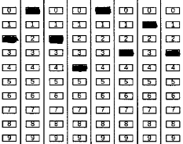

# 识别准考证号

在识别准考证号之前需要先[加载 OpenCV 库](using-opencv-in-spring-boot.md)

识别示例：



## 前提条件

1. 已知填涂的每个区域的大小。
2. 已知准考证号一共有多少位（可选）。

## 实现过程及目标

### 实现过程

1. 找出图片中所有的填涂区域。
2. 计算填涂区域在图片中的位置。
3. 将位置转换为准考证号。

### 目标

1. 识别准确率能达到 99% 及以上。
2. 不同扫描仪扫描后的黑色像素有深有浅，需要自适应。
3. 自适应不同学生的填涂风格，尽可能识别出不规范的填涂。

## 关键方法实现

```java title="Filled.java"
@Data
public class Filled {
  int minX;
  int minY;
  int maxX;
  int maxY;
  Map<Rect, Double> rect2FilledRatio = new HashMap<>();
  List<Rect> filledBoxes = new ArrayList<>();
  List<Rect> boxes = new ArrayList<>();
}
```

```java
@Data
@AllArgsConstructor
public static class RectCalculate {
  private List<List<Rect>> groupedRects;
  private double heightAvg;
  private double widthAvg;
}
```

### 读取填涂信息

```java title="OpenCvUtils.java"
  public static final int MIN_WIDTH = 16;
  public static final int MAX_WIDTH = 30;
  public static final int MIN_HEIGHT = 8;
  public static final int MAX_HEIGHT = 25;
  
  /**
   * 识别的准考证号图片的填涂信息
   *
   * @param image 图片路径
   * @return 填涂详情
   */
  public static Filled getFilled(String image) {
    Mat src = Imgcodecs.imread(image, Imgcodecs.IMREAD_COLOR);
    Mat gray = new Mat();
    Imgproc.cvtColor(src, gray, Imgproc.COLOR_BGR2GRAY);
    Mat edges = new Mat();
    Imgproc.Canny(gray, edges, 50, 150, 5, false);
    Mat lines = new Mat();
    Imgproc.HoughLinesP(edges, lines, 1, Math.PI / 180, 100, src.rows() * 0.85, 6);
    Mat mask = Mat.zeros(src.size(), CvType.CV_8UC1);
    // 去掉图片中的竖线，避免竖线对识别填涂区域的影响
    for (int i = 0; i < lines.rows(); i++) {
      double[] line = lines.get(i, 0);
      Point pt1 = new Point(line[0], line[1]);
      Point pt2 = new Point(line[2], line[3]);
      double height = Math.abs(pt1.y - pt2.y);
      Imgproc.line(mask, pt1, pt2, new Scalar(255), 3);
    }
    src.setTo(new Scalar(255, 255, 255), mask);
    Imgproc.cvtColor(src, src, Imgproc.COLOR_BGR2GRAY);
    // Denoise
    Mat denoised = new Mat();
    Imgproc.GaussianBlur(src, denoised, new Size(3, 3), 0.3, 0.3);

    // 创建一个用于存储锐化结果的 Mat 对象
    Mat sharpenedImage = new Mat();
    Mat laplacian = new Mat();
    // 应用拉普拉斯算子
    Imgproc.Laplacian(denoised, laplacian, CvType.CV_16S, 5, 2, 0, Core.BORDER_DEFAULT);
    // 转换回 CV_8U
    Core.convertScaleAbs(laplacian, laplacian);
    // 合并原图和拉普拉斯算子结果
    Core.addWeighted(denoised, 1.5, laplacian, -0.5, 8, sharpenedImage);

    // Morphological operation
    Mat morphed = new Mat();
    Mat kernel = Imgproc.getStructuringElement(Imgproc.MORPH_CROSS, new Size(1, 1));
    Imgproc.morphologyEx(sharpenedImage, morphed, Imgproc.MORPH_CLOSE, kernel);

    Scalar meanScalar = Core.mean(morphed);
    int thresh = 196;
    for (int i = 0; i < meanScalar.val.length; i++) {
      if (i == 0) {
        thresh = (int) meanScalar.val[i];
      }
    }

    Mat binaryImage = new Mat();
    Imgproc.threshold(morphed, binaryImage, thresh, 255, Imgproc.THRESH_BINARY_INV);
    List<MatOfPoint> contours = new ArrayList<>();
    Mat hierarchy = new Mat();
    Imgproc.findContours(
        binaryImage, contours, hierarchy, Imgproc.RETR_EXTERNAL, Imgproc.CHAIN_APPROX_SIMPLE);
    Integer minX = null;
    Integer minY = null;
    Integer maxX = null;
    Integer maxY = null;
    List<Rect> rects = new ArrayList<>();
    for (MatOfPoint contour : contours) {
      Rect rect = Imgproc.boundingRect(contour);
      if (OpenCvUtils.isRelevantRectangle(rect)) {
        minX = minX == null ? rect.x : Math.min(minX, rect.x);
        minY = minY == null ? rect.y : Math.min(minY, rect.y);
        maxX = maxX == null ? rect.x + rect.width : Math.max(maxX, rect.x + rect.width);
        maxY = maxY == null ? rect.y + rect.height : Math.max(maxY, rect.y + rect.height);
        rects.add(rect);
      }
    }

    if (minX == null) {
      throw new IllegalStateException("无法获取起始坐标");
    }

    RectCalculate calculate = groupRectsByX(rects, 15);
    // 计算并填充没有识别出来的填涂区域
    List<List<Rect>> errList = new ArrayList<>();
    List<List<Rect>> right = new ArrayList<>();
    Map<Integer, Double> line2y = new HashMap<>();
    for (int i = 0; i < calculate.getGroupedRects().size(); i++) {
      List<Rect> rectList = calculate.getGroupedRects().get(i);
      if (rectList.size() != 10) {
        errList.add(rectList);
      } else {
        right.add(rectList);
        for (int index = 0; index < rectList.size(); index++) {
          Rect rect = rectList.get(index);
          line2y.compute(index, (key, value) -> value == null ? rect.y : value + rect.y);
        }
      }
    }

    if (CollUtil.isNotEmpty(errList)) {
      int allDifferenceY = 18;
      int avgMinY = 0;
      for (List<Rect> rectList : right) {
        Rect preRect = null;
        for (Rect rect : rectList) {
          if (preRect == null) {
            preRect = rect;
            avgMinY += rect.y;
            continue;
          }
          allDifferenceY += Math.abs(rect.y - preRect.y);
          preRect = rect;
        }
      }
      avgMinY = avgMinY / right.size();
      allDifferenceY = allDifferenceY / (right.size() * 9);
      int finalAllDifferenceY = allDifferenceY;
      int finalAvgMinY = avgMinY;
      errList.forEach(
          (rectList) -> {
            if (rectList.size() > 10) {
              Iterator<Rect> iterator = rectList.iterator();
              line2y.forEach(
                  (lineIndex, value) -> {
                    Rect rect = iterator.next();
                    while (Math.abs(rect.y - (value / right.size())) > 5) {
                      iterator.remove();
                      rect = iterator.next();
                    }
                  });
            }
            Rect preRect = null;
            int avgX = 0;
            for (Rect rect : rectList) {
              avgX += rect.x;
            }
            avgX = avgX / rectList.size();
            for (int i = 0; i < 10; i++) {
              if (i == rectList.size() && rectList.size() < 10) {
                Rect newRect = new Rect();
                newRect.x = avgX;
                newRect.y = preRect.y + finalAllDifferenceY;
                newRect.width = (int) calculate.widthAvg;
                newRect.height = (int) calculate.heightAvg;
                rectList.add(i, newRect);
                preRect = newRect;
                continue;
              }
              Rect rect = rectList.get(i);
              if (preRect == null) {
                if (Math.abs(rect.y - finalAvgMinY) < 5) {
                  preRect = rect;
                  continue;
                }
                Rect newRect = new Rect();
                newRect.x = avgX;
                newRect.y = finalAvgMinY;
                newRect.width = (int) calculate.widthAvg;
                newRect.height = (int) calculate.heightAvg;
                rectList.add(i, newRect);
                preRect = rect;
              } else {
                if (Math.abs(rect.y - preRect.y) < finalAllDifferenceY + 5) {
                  preRect = rect;
                  continue;
                }
                Rect newRect = new Rect();
                newRect.x = avgX;
                newRect.y = preRect.y + finalAllDifferenceY;
                newRect.width = (int) calculate.widthAvg;
                newRect.height = (int) calculate.heightAvg;
                preRect = rect;
                rectList.add(i, newRect);
              }
              i++;
            }
          });
    }

    // 优化填涂区域的范围
    for (List<Rect> groupedRect : calculate.getGroupedRects()) {
      for (int i = 0; i < groupedRect.size(); i++) {
        Rect rect = groupedRect.get(i);
        Double y = line2y.get(i);
        if (rect.height > calculate.heightAvg) {
          int h = (int) ((rect.height - calculate.heightAvg) / 2);
          rect.y = y == null ? rect.y + h : (int) Math.round(y / right.size());
          rect.height = (int) calculate.heightAvg;
        }
        if (rect.width > calculate.widthAvg) {
          int w = (int) ((rect.width - calculate.widthAvg) / 2);
          rect.x = rect.x + w;
          rect.width = (int) calculate.widthAvg;
        }
      }
    }
    // 计算填涂区域的黑色像素百分比
    Map<Rect, Double> rect2fill = new HashMap<>();
    for (List<Rect> groupedRect : calculate.groupedRects) {
      for (Rect rect : groupedRect) {
        Mat roi = binaryImage.submat(rect);
        double filledRatio = (double) Core.countNonZero(roi) / rect.area();
        rect2fill.put(rect, filledRatio);
      }
    }
    Collection<Double> fills = rect2fill.values();
    double[] filledArray = new double[fills.size()];
    int index = 0;
    double sum = 0.0;
    for (Double value : fills) {
      filledArray[index++] = value;
      sum += value;
    }
    double average = sum / filledArray.length;
    double variance = StatUtils.variance(filledArray);
    double standardDeviation = Math.sqrt(variance);
    // 筛选出 10% 左右的异常值识别为已填涂
    double filledThreshold = average + 1.645 * standardDeviation;
    List<Rect> filledBoxes = new ArrayList<>();
    for (Map.Entry<Rect, Double> entry : rect2fill.entrySet()) {
      Double filledRatio = entry.getValue();
      if (filledRatio > filledThreshold) {
        filledBoxes.add(entry.getKey());
      }
    }
    Filled filled = new Filled();
    filled.setBoxes(rects);
    filled.setFilledBoxes(filledBoxes);
    filled.setRect2FilledRatio(rect2fill);
    filled.setMinX(minX);
    filled.setMaxX(maxX);
    filled.setMinY(minY);
    filled.setMaxY(maxY);
    return filled;
  }
  
  /**
   * 对填涂的区域根据 x 坐标进行分组，计算平均宽度和高度
   * 
   * @param rects 填涂区域列表
   * @param threshold 分组依据：填涂区域 x 坐标轴的差值范围
   * @return 分组详情、填涂区域的平均宽高
   */
  public static RectCalculate groupRectsByX(List<Rect> rects, int threshold) {
    rects.sort(Comparator.comparingInt(r -> r.x));
    List<List<Rect>> groupedRects = new ArrayList<>();
    List<Rect> currentGroup = new ArrayList<>();
    double heightAvg = 0.0;
    double widthAvg = 0.0;
    for (Rect rect : rects) {
      heightAvg += rect.height;
      widthAvg += rect.width;
      if (currentGroup.isEmpty()) {
        currentGroup.add(rect);
      } else {
        Rect lastRect = currentGroup.get(currentGroup.size() - 1);
        if (rect.x - lastRect.x <= threshold) {
          currentGroup.add(rect);
        } else {
          groupedRects.add(new ArrayList<>(currentGroup));
          currentGroup.clear();
          currentGroup.add(rect);
        }
      }
    }
    if (!currentGroup.isEmpty()) {
      groupedRects.add(currentGroup);
    }
    for (List<Rect> groupedRect : groupedRects) {
      groupedRect.sort(Comparator.comparingInt(r -> r.y));
    }
    heightAvg = heightAvg / rects.size();
    widthAvg = widthAvg / rects.size();
    return new RectCalculate(groupedRects, heightAvg, widthAvg);
  }
  
  /**
   * 判断是否是填涂区域
   * @param rect 填涂区域
   * @return true：是、false：不是
   */
  public static boolean isRelevantRectangle(Rect rect) {
    return rect.width > OpenCvUtils.MIN_WIDTH
        && rect.width < OpenCvUtils.MAX_WIDTH
        && rect.height > OpenCvUtils.MIN_HEIGHT
        && rect.height < OpenCvUtils.MAX_HEIGHT;
  }
```

### 识别准考证号

```java title="OpenCvUtils.java"
  /**
   * 识别准考证号
   * @param count 准考证号位数
   * @param image 准考证号图片
   * @return 准考证号
   */
  @SneakyThrows
  public static String getAdmissionTicketNum(Integer count, String image) {
    Filled filled = OpenCvUtils.getFilled(image);
    List<Rect> rects = filled.getFilledBoxes();
    Map<Rect, Double> rect2FilledRatio = filled.getRect2FilledRatio();
    Map<Integer, Double> column2filledRatio = new HashMap<>();
    rects.sort(Comparator.comparingDouble(r -> r.y)); // sort by top position
    int[] ticket = new int[count];
    for (Rect rect : rects) {
      double columnPositionX = rect.x + rect.width / 2.0 - filled.getMinX();
      int columnX =
          (int) ((columnPositionX / (filled.getMaxX() - filled.getMinX())) * count); // count
      double yPos = rect.y + rect.height / 2.0 - filled.getMinY();
      int columnY = (int) ((yPos / (filled.getMaxY() - filled.getMinY())) * 10); // 10 line
      Double filledRatio = rect2FilledRatio.get(rect);
      // 同一列中取黑色像素百分比最大的填涂区域
      if (column2filledRatio.containsKey(columnX)) {
        Double pre = column2filledRatio.get(columnX);
        if (pre > filledRatio) {
          continue;
        }
      }
      column2filledRatio.put(columnX, filledRatio);
      ticket[columnX] = columnY;
    }
    FileUtil.del(file);
    return Arrays.stream(ticket).mapToObj(String::valueOf).reduce((a, b) -> a + b).orElse(null);
  }
```
