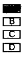
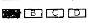

# 识别选择题

在识别选择题前需要先[加载 OpenCV 库](using-opencv-in-spring-boot.md)

识别示例：

垂直布局：

水平布局：

## 识别流程及目标

### 识别流程

1. 读取图片，根据填涂区域的宽高识别出图片中的填涂区域
2. 计算每个填涂区域的黑色像素的占比，根据占比判断是否填涂
3. 将填涂的区域坐标转换为选项

### 目标

1. 不同扫描仪扫描出来的图片质量不一样，需要自适应
2. 尽可能识别出填涂不规范的图片
3. 填涂比较规范的图片识别准确率尽可能达到 99% 及以上

## 识别方法的代码实现

```java title="OpenCvUtils.java"

  public static final int OPTION_WIDTH = 15;
  public static final int OPTION_HEIGHT = 9;
  public static final double PERCENTAGE_IS_FILLING = 0.75;
  public static final double SECOND_PERCENTAGE_IS_FILLING = 0.67;
  
  /**
   * 识别选择题填涂结果
   * @param optionNum 选择题选项个数
   * @param image 识别的图片
   * @return 识别结果
   */
  private static String getChoiceResult(Integer optionNum, String image) {
    // 默认 4 个选项
    optionNum = optionNum == null ? 4 : optionNum;
    Mat src = Imgcodecs.imread(image, Imgcodecs.IMREAD_GRAYSCALE);
    // Denoise
    Mat denoised = new Mat();
    Imgproc.GaussianBlur(src, denoised, new Size(3, 3), 0.3, 0.3);
    // 创建一个用于存储锐化结果的 Mat 对象
    Mat sharpenedImage = new Mat();
    Mat laplacian = new Mat();
    // 应用拉普拉斯算子
    Imgproc.Laplacian(denoised, laplacian, CvType.CV_16S, 5, 2, 0, Core.BORDER_REFLECT);
    // 转换回 CV_8U
    Core.convertScaleAbs(laplacian, laplacian);
    Core.addWeighted(denoised, 1.5, laplacian, -0.5, 8, sharpenedImage);
    // Morphological operation
    Mat morphed = new Mat();
    Mat kernel = Imgproc.getStructuringElement(Imgproc.MORPH_CROSS, new Size(1, 1));
    Imgproc.morphologyEx(sharpenedImage, morphed, Imgproc.MORPH_CLOSE, kernel);
    Scalar meanScalar = Core.mean(morphed);
    int thresh = 196;
    for (int i = 0; i < meanScalar.val.length; i++) {
      if (i == 0) {
        // 动态阈值
        thresh = (int) meanScalar.val[i];
      }
    }
    Mat binaryImage = new Mat();
    Imgproc.threshold(morphed, binaryImage, thresh - 15, 255, Imgproc.THRESH_BINARY_INV);
    List<MatOfPoint> contours = new ArrayList<>();
    Mat hierarchy = new Mat();
    Imgproc.findContours(
        binaryImage, contours, hierarchy, Imgproc.RETR_EXTERNAL, Imgproc.CHAIN_APPROX_SIMPLE);
    List<Rect> rects = new ArrayList<>(optionNum);
    for (MatOfPoint contour : contours) {
      Rect rect = Imgproc.boundingRect(contour);
      if (rect.width >= OpenCvUtils.OPTION_WIDTH && rect.height >= OpenCvUtils.OPTION_HEIGHT) {
        rects.add(rect);
      }
    }
    return Arrangement.get(src).getResult(optionNum, rects, binaryImage);
  }
```

```java title="GetChoiceResult.jva"
public interface GetChoiceResult {

  String getResult(Integer optionNum, List<Rect> rects, Mat binaryImage);
}
```

```java title="Arrangement.java"
public enum Arrangement implements GetChoiceResult {
  HORIZONTAL {
    @Override
    public String getResult(Integer optionNum, List<Rect> rects, Mat binaryImage) {
      Integer minX = null;
      Integer minY = null;
      Integer maxX = null;
      Integer maxY = null;
      for (Rect rect : rects) {
        minX = minX == null ? rect.x : Math.min(minX, rect.x);
        minY = minY == null ? rect.y : Math.max(minY, rect.y);
        maxX = maxX == null ? rect.x + rect.width : Math.max(maxX, rect.x + rect.width);
        int minMaxY = maxY == null ? rect.y + rect.height : Math.min(maxY, rect.y + rect.height);
        if (minMaxY > minY) {
          maxY = minMaxY;
        }
      }

      if (minX == null || maxY == null) {
        throw new IllegalStateException("无法获取选择题X轴=%s、Y轴=%s 坐标".formatted(minX, maxY));
      }

      Rect allSelect = new Rect();
      allSelect.x = Math.max(minX - 2, 0);
      allSelect.y = minY;
      allSelect.width = Math.min(maxX - minX + 4, binaryImage.cols() - allSelect.x);
      allSelect.height = Math.min(maxY - minY, binaryImage.height() - allSelect.y);
      // 识别出的填涂区域没有达到选项个数、计算填充识别区域
      while (rects.size() < optionNum
          && (22 * optionNum - allSelect.width) >= 18
          && allSelect.width < binaryImage.cols()) {
        int left = allSelect.x;
        int right = binaryImage.cols() - allSelect.x - allSelect.width;
        if (left > right) {
          int newX = Math.max(allSelect.x - 22, 0);
          allSelect.width += allSelect.x - newX;
          minX = Math.max(minX - (allSelect.x - newX), 0);
          allSelect.x = newX;
        }
        if (right > left) {
          allSelect.width = Math.min(allSelect.width + 22, binaryImage.cols() - allSelect.x);
          maxX = Math.min(binaryImage.cols(), allSelect.x + allSelect.width);
        }
      }
      double averageWidth = (double) allSelect.width / optionNum;
      List<Rect> selectRect = new ArrayList<>();
      for (int i = 0; i < optionNum; i++) {
        Rect select = new Rect();
        select.x = allSelect.x + (int) (i * averageWidth) + 2;
        select.y = minY;
        select.width = (int) (averageWidth) - 4;
        select.height = allSelect.height;
        selectRect.add(select);
      }
      List<Rect> filledBoxes = getFilledBox(binaryImage, selectRect);
      filledBoxes.sort(Comparator.comparingDouble(r -> r.x)); // sort by x position
      StringBuilder result = new StringBuilder();
      for (Rect rect : filledBoxes) {
        double columnPositionX = rect.x + rect.width / 2.0 - minX;
        int columnX = (int) ((columnPositionX / (maxX - minX)) * optionNum); // column
        String anno = index2ColName(columnX);
        result.append(anno);
      }
      return result.toString();
    }
  },

  VERTICAL {
    @Override
    public String getResult(Integer optionNum, List<Rect> rects, Mat binaryImage) {
      Integer minX = null;
      Integer minY = null;
      Integer maxX = null;
      Integer maxY = null;
      for (Rect rect : rects) {
        minX = minX == null ? rect.x : Math.min(minX, rect.x);
        minY = minY == null ? rect.y : Math.min(minY, rect.y);
        maxY = maxY == null ? rect.y + rect.height : Math.max(maxY, rect.y + rect.height);
        int minMaxX = maxX == null ? rect.x + rect.width : Math.min(maxX, rect.x + rect.width);
        if (minMaxX > minX) {
          maxX = minMaxX;
        }
      }

      if (minY == null || maxX == null) {
        throw new IllegalStateException("无法获取选择题X轴=%s、Y轴=%s 坐标".formatted(minX, maxX));
      }

      Rect allSelect = new Rect();
      allSelect.x = minX;
      allSelect.y = Math.max(minY - 2, 0);
      allSelect.width = Math.min(maxX - minX, binaryImage.cols() - allSelect.x);
      allSelect.height = Math.min(maxY - minY + 4, binaryImage.height() - allSelect.y);
      // 识别出的填涂区域没有达到选项个数、计算填充识别区域
      while (rects.size() < optionNum
          && (13 * optionNum - allSelect.height) >= 9
          && allSelect.height < binaryImage.rows()) {
        int top = allSelect.y;
        int bottom = binaryImage.rows() - allSelect.y - allSelect.height;
        if (top > bottom) {
          int newY = Math.max(allSelect.y - 13, 0);
          allSelect.height += allSelect.y - newY;
          minY = Math.max(minY - (allSelect.y - newY), 0);
          allSelect.y = newY;
        }
        if (bottom > top) {
          allSelect.height = Math.min(allSelect.height + 13, binaryImage.rows() - allSelect.y);
          maxY = Math.min(binaryImage.rows(), allSelect.y + allSelect.height);
        }
      }
      double averageHeight = (double) allSelect.height / optionNum;
      List<Rect> selectRect = new ArrayList<>();
      for (int i = 0; i < optionNum; i++) {
        Rect select = new Rect();
        select.y = allSelect.y + (int) (i * averageHeight) + 2;
        select.x = minX;
        select.height = (int) averageHeight - 4;
        select.width = allSelect.width;
        selectRect.add(select);
      }
      List<Rect> filledBoxes = getFilledBox(binaryImage, selectRect);
      filledBoxes.sort(Comparator.comparingDouble(r -> r.y)); // sort by y position
      StringBuilder result = new StringBuilder();
      for (Rect rect : filledBoxes) {
        double columnPositionY = rect.y + rect.height / 2.0 - minY;
        int columnY = (int) ((columnPositionY / (maxY - minY)) * optionNum); // column
        String anno = index2ColName(columnY);
        result.append(anno);
      }
      return result.toString();
    }
  };

  /**
   * 根据图片信息判断是垂直布局还是水平布局
   */
  public static Arrangement get(Mat src) {
    if (src == null) {
      return null;
    }
    int width = src.width();
    int height = src.height();
    if (width > height) {
      return HORIZONTAL;
    }
    return VERTICAL;
  }

  // 编号转答案0-A 1-B
  private static String index2ColName(int index) {
    if (index < 0) {
      return null;
    }
    int num = 65; // A的Unicode码
    StringBuilder colName = new StringBuilder();
    do {
      if (!colName.isEmpty()) {
        index--;
      }
      int remainder = index % 26;
      colName.insert(0, ((char) (remainder + num)));
      index = (index - remainder) / 26;
    } while (index > 0);
    return colName.toString();
  }

  /**
   * 获取填涂的区域
   */
  private static List<Rect> getFilledBox(Mat binaryImage, List<Rect> selectRect) {
    List<Rect> filledBoxes = new ArrayList<>();
    for (Rect rect : selectRect) {
      double filledRatio = getFilledRatio(binaryImage, rect);
      if (filledRatio > OpenCvUtils.PERCENTAGE_IS_FILLING) {
        filledBoxes.add(rect);
      } else if (filledRatio > OpenCvUtils.SECOND_PERCENTAGE_IS_FILLING
          && (rect.height >= OpenCvUtils.OPTION_HEIGHT && rect.width >= OpenCvUtils.OPTION_WIDTH)) {
        // 填涂区域过大，裁剪的区域过大，取图片的其他区域判断该填涂区域是否填涂
        int height = OpenCvUtils.OPTION_HEIGHT;
        int width = OpenCvUtils.OPTION_WIDTH;
        // 左上角
        Rect topLeft = new Rect(rect.x, rect.y, width, height);
        filledRatio = getFilledRatio(binaryImage, topLeft);
        if (filledRatio > OpenCvUtils.PERCENTAGE_IS_FILLING) {
          filledBoxes.add(topLeft);
          continue;
        }
        // 左下角
        Rect bottomLeft = new Rect(rect.x, rect.y + rect.height - height, width, height);
        filledRatio = getFilledRatio(binaryImage, bottomLeft);
        if (filledRatio > OpenCvUtils.PERCENTAGE_IS_FILLING) {
          filledBoxes.add(bottomLeft);
          continue;
        }
        // 中间
        Rect center =
            new Rect(
                rect.x + (rect.width - width) / 2,
                rect.y + (rect.height - height) / 2,
                width,
                height);
        filledRatio = getFilledRatio(binaryImage, center);
        if (filledRatio > OpenCvUtils.PERCENTAGE_IS_FILLING) {
          filledBoxes.add(center);
          continue;
        }
        // 右下角
        Rect bottomRight =
            new Rect(rect.x + rect.width - width, rect.y + rect.height - height, width, height);
        filledRatio = getFilledRatio(binaryImage, bottomRight);
        if (filledRatio > OpenCvUtils.PERCENTAGE_IS_FILLING) {
          filledBoxes.add(bottomRight);
          continue;
        }
        // 右上角
        Rect topRight = new Rect(rect.x + rect.width - width, rect.y, width, height);
        filledRatio = getFilledRatio(binaryImage, topRight);
        if (filledRatio > OpenCvUtils.PERCENTAGE_IS_FILLING) {
          filledBoxes.add(topRight);
        }
      }
    }
    return filledBoxes;
  }

  private static double getFilledRatio(Mat mat, Rect rect) {
    Mat submat = mat.submat(rect);
    return (double) Core.countNonZero(submat) / (rect.width * rect.height);
  }
}
```
